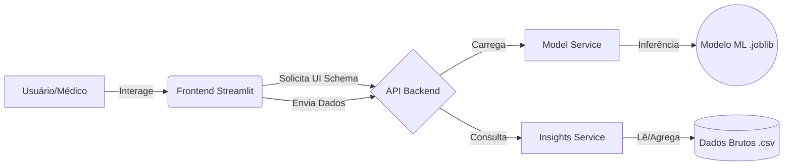

<div align="center">
  
  <h1>Obesity Risk CDSS</h1>
  <p>
    Sistema de Suporte à Decisão Clínica baseado em Machine Learning
  </p>
</div>

Um Sistema de Suporte à Decisão Clínica (CDSS) desenvolvido para auxiliar profissionais de saúde na identificação de níveis de risco de obesidade em pacientes. O projeto utiliza Machine Learning para fornecer uma "segunda opinião" baseada em dados sobre o estilo de vida e alimentação dos pacientes.

## Arquitetura do projeto

O projeto segue princípios de **Clean Architecture** e **Server-Driven UI**, dividido em microsserviços conceituais:



- **Frontend (Streamlit):** Interface em português para que o usuário consiga interagir com o modelo preditivo, conferir métricas e insights
- **Backend (FastAPI):** Exposição do modelo, validação de dados com Pydantic, serviços para privacidade dos dados e documentação com Swagger
- **Core ML:** Pipelines de treinamento reprodutíveis com Scikit-Learn e XGBoost

## Tech stack

- **Linguagem:** Python 3.12+
- **Gerenciador de Pacotes:** uv
- **API:** FastAPI + Uvicorn
- **Interface:** Streamlit
- **Machine Learning:** Scikit-Learn, XGBoost, Pandas
- **Qualidade de Código:** Ruff (Linting/Formatting), Pre-commit
- **Infraestrutura:** Docker & Docker Compose

## Demonstração de funcionalidades

Confira a documentação da API:


Veja o sistema em ação diagnosticando um paciente em tempo real:


## Como executar

Você pode rodar o projeto de duas formas, via Docker (recomendado) ou localmente. Para isso, certifique-se que você tenha instalado os seguintes **pré-requisitos**:

- Git
- Docker & Docker Compose **OU** Python 3.12+ e `uv` instalado

<details>
    <summary><b>Opção 1</b>: Docker</summary>

Esta opção sobe todo o ambiente (treinamento, API e frontend) isoladamente.

1.  **Clone o repositório:**

    ```bash
    git clone https://github.com/umpuela/obesity-cdss.git
    cd obesity-cdss
    ```

2.  **Configure o ambiente:** Faça uma cópia do arquivo `.env.example` e o renomeie como `.env` na raiz:

    ```bash
    cp .env.example .env
    ```

3.  **Treine o modelo:** Antes de subir a API, gere o artefato do modelo:

    ```bash
    docker compose run --rm trainer
    ```

4.  **Inicie a aplicação:**

    ```bash
    docker compose up
    ```

Acesse a API e o frontend a partir das portas configuradas no `env`, por exemplo:

- **API:** `http://localhost:8000`
- **Frontend:** `http://localhost:8501`

</details>

<details>
    <summary><b>Opção 2</b>: Localmente</summary>

Após clonar o repositório e configurar o ambiente, execute os seguintes passos:

1.  **Instale as dependências:**

    ```bash
    uv sync
    ```

2.  **Ative o ambiente virtual:**

    ```bash
    source .venv/bin/activate  # Linux/Mac
    # .venv\Scripts\activate   # Windows
    ```

3.  **Treine o modelo:**

    ```bash
    uv run -m obesity_cdss.ml.train
    ```

4.  **Inicie a API (terminal 1):**

    ```bash
    uv run uvicorn obesity_cdss.api.main:app --reload
    ```

5.  **Inicie o frontend (terminal 2):**

    ```bash
    uv run streamlit run src/obesity_cdss/web/app.py
    ```

6.  **(Opcional) Rode os testes:**

    ```bash
    uv run pytest
    ```

</details>

## Estrutura do projeto

```plaintext
obesity-cdss/
├── .streamlit/            # Configurações visuais do frontend
├── data/                  # Dados brutos (ignorado no git)
├── models/                # Artefatos do modelo (ignorado no git)
├── reports/               # Métricas e logs (ignorado no git)
├── notebooks/             # Notebooks Jupyter
├── assets/                # Imagens e GIFs usados neste README
├── src/
│   └── obesity_cdss/
│       ├── api/           # Backend FastAPI (rotas, serviços e schemas)
│       ├── ml/            # Pipeline de Machine Learning (processamento e treino)
│       ├── web/           # Frontend Streamlit (telas de predição e dashboards)
│       ├── utils/         # Logging e configurações auxiliares
│       └── config.py      # Configuração global
├── tests/                 # Testes unitários e de integração
├── docker-compose.yml     # Orquestração
├── Dockerfile             # Imagem única otimizada
├── pyproject.toml         # Gerenciamento de dependências (UV)
└── README.md
```

## Licença

Este projeto está licenciado sob a Licença MIT. Confira o [arquivo LICENSE](/LICENSE) para mais detalhes.
